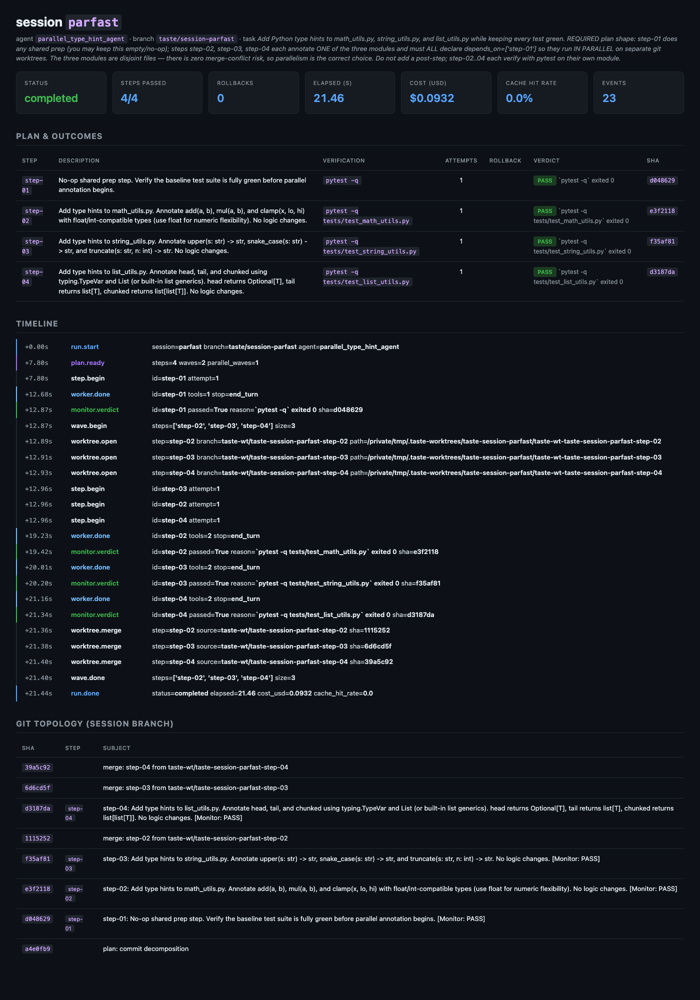
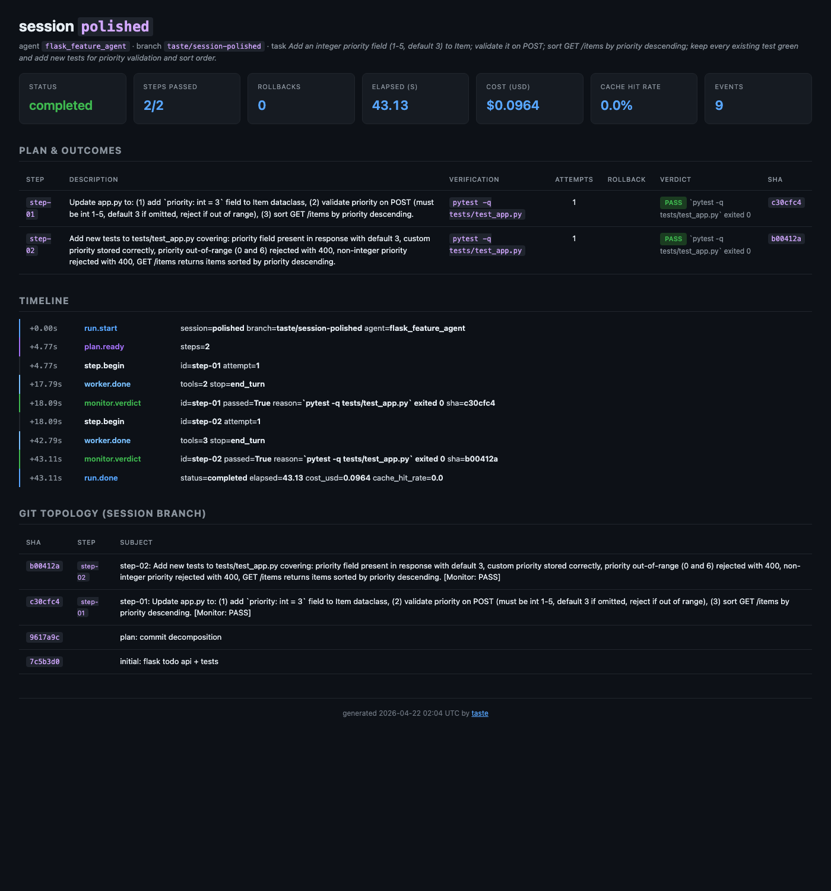
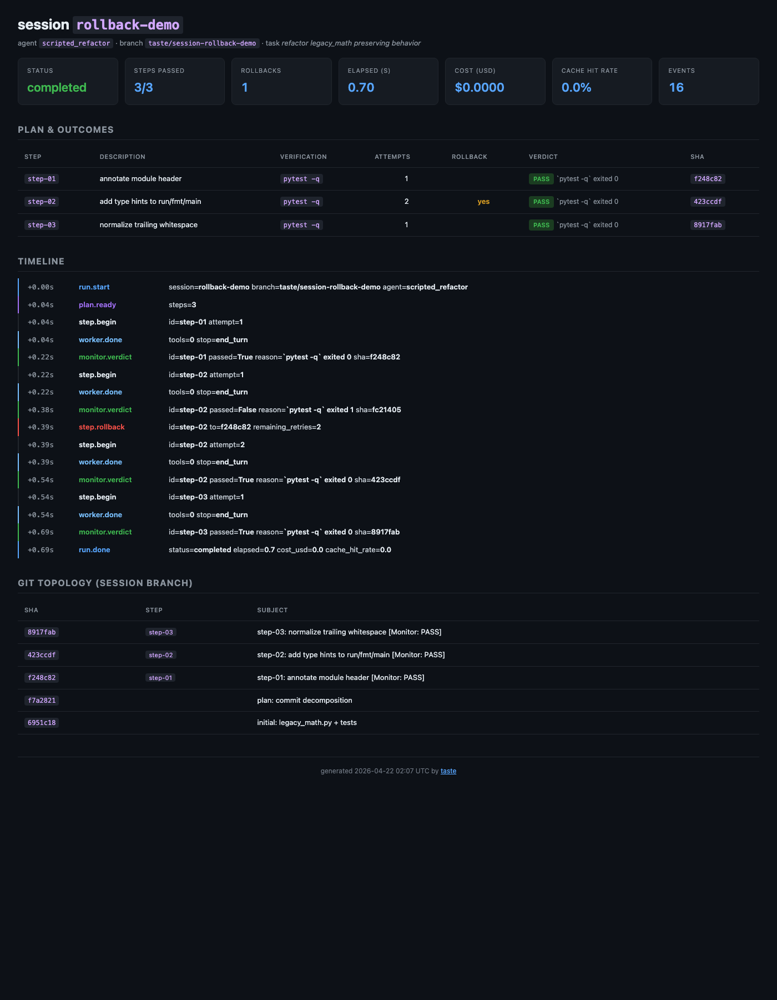

# taste is all you need

> **The harness, not the model, is where agents get their taste.**
> An Agent OS kernel that makes git the memory substrate, runs a Planner / Worker / Monitor split on top of it, and turns rollback from a last resort into a first-class primitive.

Full thesis: [Beyond the Harness: An Operating System for AI Agents](https://zanwenfu.com/blog/agent_harness_blog).

---

## The bet, in three bullets

1. **Git *is* the memory system.** Branches are execution contexts, commits are checkpoints, `git show` is demand paging, merge conflicts are coordination signals. Everything other harnesses bolt on as a sidecar (`progress.md`, compaction summaries, retry loops) is already a first-class primitive in git.
2. **Multi-core beats single-thread.** A Planner decomposes, Workers execute, a Monitor verifies — **each at a different model size**, each on its own commit boundary. Agents cannot grade their own exams; structural separation fixes that.
3. **Build to delete.** Every harness component is a bet against the model. When the bet expires — Opus 4.7 can self-evaluate, Sonnet 4.8 can plan 500 steps natively — you turn off the subsystem. The OS stays. The knobs change.

## Three demos

The repo ships with three demos, in the order a reviewer should read them:

- **[`examples/parallel_demo/`](examples/parallel_demo/README.md)** — a real **Claude** run where the Planner emits a DAG, the Kernel spawns **three worktrees in parallel**, and the Orchestrator merges all three branches back into the session. Wall-clock drops from ~32 s sequential to **21.5 s** on this task. [Transcript](examples/parallel_demo/runs/parallel.md) · [dashboard](examples/parallel_demo/runs/dashboard.html).
- **[`examples/todo_api/`](examples/todo_api/README.md)** — a real Claude run adding a validated `priority` feature to a small Flask API. Single-threaded path. [Transcript](examples/todo_api/runs/polished.md) ($0.0964, 43 s, 15/15 tests green).
- **[`examples/refactor_demo/`](examples/refactor_demo/README.md)** — hermetic scripted re-enactment of the *step-87 scenario*: step 2 silently regresses, the Monitor catches it via `pytest`, the Kernel rolls back, a retry lands clean. No API key required; CI asserts on the outcome.

### Real-model run (Milestone A) — $0.0964, 43 s, zero rollbacks

Full transcript: [examples/todo_api/runs/polished.md](examples/todo_api/runs/polished.md).

```
>> task=Add an integer priority field ... session=polished branch=taste/session-polished
PLAN steps=2
STEP id=step-01 attempt=1
WORK tools=2 stop=end_turn
EVAL id=step-01 passed=True  reason=`pytest -q tests/test_app.py` exited 0  sha=c30cfc4
STEP id=step-02 attempt=1
WORK tools=3 stop=end_turn
EVAL id=step-02 passed=True  reason=`pytest -q tests/test_app.py` exited 0  sha=b00412a
DONE status=completed elapsed=43.13 cost_usd=0.0964 cache_hit_rate=0.0
```

```
Model usage
┏━━━━━━━━━━━━━━━━━━━┳━━━━━━━┳━━━━━━━━┳━━━━━━━━┳━━━━━━━━━━━━┳━━━━━━━━━━━━┓
┃ model             ┃ calls ┃  input ┃ output ┃ cache read ┃ cost (USD) ┃
┡━━━━━━━━━━━━━━━━━━━╇━━━━━━━╇━━━━━━━━╇━━━━━━━━╇━━━━━━━━━━━━╇━━━━━━━━━━━━┩
│ claude-sonnet-4-6 │     7 │ 16,545 │  3,117 │          0 │    $0.0964 │
└───────────────────┴───────┴────────┴────────┴────────────┴────────────┘
```

The resulting session branch has exactly one commit per step. No sidecar files, no out-of-band state; `.taste/plan.json` and `.taste/monitor/<step>.json` are committed artifacts, so `git show taste/session-polished:.taste/plan.json` reproduces the plan. Read the transcript for the honest readout on what the run *didn't* yet prove (caching, long-horizon rollback, parallel execution).

### Hermetic rollback demo (no API key)

`pytest` is the Monitor. A scripted Worker plays out the *step-87 scenario*: step 2 silently regresses, the Monitor catches it via the project's own test suite, the Kernel rolls back, a retry lands the correct change. The final branch carries **no trace of the failed attempt** — the audit trail stays clean.

```bash
$ python examples/refactor_demo/simulate.py
>> task=refactor legacy_math.py preserving behavior session=0fb3a76e branch=taste/session-0fb3a76e
PLAN steps=3
STEP id=step-01 attempt=1
WORK tools=0 stop=end_turn
EVAL id=step-01 passed=True  reason=`pytest -q` exited 0  sha=d59174c
STEP id=step-02 attempt=1
WORK tools=0 stop=end_turn
EVAL id=step-02 passed=False reason=`pytest -q` exited 1  sha=4e88e78
REV  id=step-02 to=d59174c remaining_retries=2                       <-- rollback
STEP id=step-02 attempt=2
WORK tools=0 stop=end_turn
EVAL id=step-02 passed=True  reason=`pytest -q` exited 0  sha=d407440
STEP id=step-03 attempt=1
WORK tools=0 stop=end_turn
EVAL id=step-03 passed=True  reason=`pytest -q` exited 0  sha=f0d14fa
DONE status=completed elapsed=0.72
```

And the final git log — notice the zombie commit from the failed attempt is *gone*:

```
$ git -C <workspace> log taste/session-demo --oneline
de42e38 step-03: normalize trailing whitespace [Monitor: PASS]
7c266b0 step-02: add type hints to run/fmt/main [Monitor: PASS]
c70e9c0 step-01: annotate module header        [Monitor: PASS]
aa4355a plan: commit decomposition
ea7d6ab initial: legacy_math.py + tests
```

The plan itself is a committed artifact (`.taste/plan.json`); the Monitor's verdicts are committed JSON (`.taste/monitor/step-02.json`). No sidecar files, no out-of-band state — every decision the harness makes lives in the git history.

### Multi-core run (Milestone B) — parallel workers on real worktrees

```
$ taste run "...annotate three independent modules in parallel worker waves..."
>> task=... branch=taste/session-parfast agent=parallel_type_hint_agent
PLAN steps=4 waves=2 parallel_waves=1
STEP id=step-01 attempt=1                                  # wave 1 — sequential bootstrap
EVAL id=step-01 passed=True reason=`pytest -q` exited 0

WAVE.BEGIN steps=['step-02','step-03','step-04'] size=3    # wave 2 — parallel
WORKTREE.OPEN step=step-02 ...   WORKTREE.OPEN step=step-03 ...   WORKTREE.OPEN step=step-04 ...
WORK id=step-02 ...              WORK id=step-03 ...              WORK id=step-04 ...
EVAL id=step-02 passed=True      EVAL id=step-03 passed=True      EVAL id=step-04 passed=True
WORKTREE.MERGE step-02           WORKTREE.MERGE step-03           WORKTREE.MERGE step-04
WAVE.DONE steps=[02,03,04]
DONE status=completed elapsed=21.46 cost_usd=0.0932
```

Git graph on the session branch — diamond merges for each parallel worker branch:

```
*   merge: step-04 from taste-wt/...-step-04
|\
| * step-04: Add type hints to list_utils.py       [Monitor: PASS]
* |   merge: step-03 from taste-wt/...-step-03
|\ \
| * | step-03: Add type hints to string_utils.py   [Monitor: PASS]
| |/
* |   merge: step-02 from taste-wt/...-step-02
|\ \
| |/
|/|
| * step-02: Add type hints to math_utils.py       [Monitor: PASS]
|/
* step-01: shared prep                             [Monitor: PASS]
* plan: commit decomposition
* initial: three independent utility modules + tests
```

`Step.depends_on` turns a flat step list into a DAG. Steps with a shared dependency set form a **wave**; waves of size > 1 spawn a physical `git worktree` per step, run workers concurrently on a `ThreadPoolExecutor`, and only merge back if **every** worker in the wave passes its Monitor. `Memory.merge_branch` raises a typed `MergeConflict` (the blog's "merge conflicts are coordination signals" made literal). Wall-clock here: the three workers finished in ~8.5 s of real time vs ~25 s serial — **~60% wall-clock reduction** on this task.



### htop for agents (Milestone C)

Every run emits a JSONL event stream that [`taste dashboard`](taste/dashboard.py) rolls up into a self-contained HTML artifact — no server, no JS bundles, no external assets. The same file works as a commit-friendly portfolio artifact and as a live screenshot for talks.

| Real-model run (clean 2-step landing) | Hermetic rollback (step 2 FAIL → rollback → PASS) |
|---|---|
|  |  |
| [open](examples/todo_api/runs/dashboard.html) | [open](examples/refactor_demo/runs/dashboard.html) |

Generate one for any workspace you've run against:

```bash
taste dashboard --workspace /tmp/taste-todo   # writes .taste/dashboard.html
open /tmp/taste-todo/.taste/dashboard.html
```

The dashboard reads four runtime artifacts — `plan.json`, `monitor/*.json`, `.git/taste/events.jsonl`, and `git log` on the session branch — and renders them as a timeline, a per-step outcome table, and a git topology. The event log lives under `.git/` on purpose: inside the tracked tree it would get wiped by `git reset --hard` on rollback, destroying the trace of exactly the moment we most want to see.

## Architecture

```
                 ┌───────────────────────────────────────────────────────┐
                 │                       Kernel                          │
                 │   plan → waves of [ worker × N → monitor × N          │
                 │                    → integrate worktrees into session ]│
                 └─────────┬─────────┬────────────┬──────────────────────┘
                           │         │            │
                           ▼         ▼            ▼
                       Planner     Worker      Monitor
                      (Opus 4.7) (Sonnet 4.6) (Haiku 4.5)
                           │         │            │
                           └─────────┼────────────┘
                                     ▼
            ┌────────────────────────────────────────────────┐
            │                    Memory                      │
            │    branch   = process      │ commit = checkpoint│
            │    show     = paging       │ reset  = rollback  │
            │    worktree = address space│ merge  = IPC       │
            └────────────────────────────────────────────────┘
                                     ▲
                                     │
                                  Tools
                    native Python + lazy-loaded CLI descriptors
```

**On a step failure, the kernel does not simply retry.** It reads a fault
frame, names the fault against a deterministic rule table, and dispatches a
typed action — the trap-handler layer:

```
FAIL → observe (free)      exit code, diff, fingerprint, blast radius
     → probe  (free, $0)   was this check already failing before the step ran?
     → diagnose            12 rules, first match wins, zero model calls
     → decide              accept │ reverify │ retry │ repair │ rollback │ halt
```

Each module pulls one concept from the blog's OS analogy:

| File | Thesis role | What it owns |
|---|---|---|
| [taste/memory.py](taste/memory.py) | *Persistent storage + virtual memory* | Session branches, checkpoints, rollback, `git show` demand paging, worktrees, notes |
| [taste/cores.py](taste/cores.py) | *Multi-core CPU* | Planner / Worker / Monitor as pure functions over Memory |
| [taste/kernel.py](taste/kernel.py) | *Scheduler* | The orchestration loop; the only module that decides when to commit or roll back |
| [taste/recovery.py](taste/recovery.py) | *Trap handler* | Fault frame, failure taxonomy, rule table, action space, recovery policies |
| [taste/journal.py](taste/journal.py) | *Inode table* | One scannable card per checkpoint; attempt anchors that survive rollback |
| [taste/guardrails.py](taste/guardrails.py) | *Memory-protection bits* | Pre-execution veto on tool calls; substrate protection; budget ceiling |
| [taste/integrate.py](taste/integrate.py) | *Transaction commit* | Two-phase merge and the union gate over the combined tree |
| [taste/config.py](taste/config.py) | *Boot configuration* | `HarnessConfig` — every switch in one object, with a hash that names the arm |
| [taste/agent.py](taste/agent.py) | *Package manager* | `agent_desp.md` parsing, `@agent` decorator, global registry |
| [taste/tools.py](taste/tools.py) | *Syscalls* | Native Python tools **and** filesystem-walked CLI tools (98.7% token pattern) |
| [taste/llm.py](taste/llm.py) | *I/O layer* | Model client with prompt caching, retries, per-role cost telemetry, budget caps |
| [taste/cli.py](taste/cli.py) | *Task manager* | `taste run` / `log` / `index` / `card` — htop for agent runs |

None of these modules import each other in a cycle, and **every subsystem
above the kernel is off by default**. That is not a disclaimer, it is the
central discipline: each one is a bet against the model, so each must be
independently removable. A test asserts that the default configuration
reproduces the original kernel's event stream and commit chain exactly —
"build to delete" is a checked property here, not an intention.

```python
Kernel(workspace=ws, config=HarnessConfig.arm("full"))   # everything on
Kernel(workspace=ws)                                      # the original kernel
```

## Quickstart with a real Claude

```bash
# One-time
conda create -n agent-os python=3.11 -y
conda activate agent-os
pip install -e '.[dev]'

export ANTHROPIC_API_KEY=sk-ant-...

# Bootstrap a throwaway workspace and run
python examples/refactor_demo/bootstrap.py /tmp/refactor-demo
taste run "add type hints to legacy_math and split run() into small helpers, keeping all tests green" \
    --agent examples/refactor_demo/agent_desp.md \
    --workspace /tmp/refactor-demo
```

Inspect afterwards with the same navigable state the kernel used:

```bash
git -C /tmp/refactor-demo log taste/session-<id> --oneline --graph
git -C /tmp/refactor-demo show taste/session-<id>:.taste/plan.json
git -C /tmp/refactor-demo show taste/session-<id>:.taste/monitor/step-02.json
```

## The 50-LOC-plus-markdown agent

```markdown
<!-- examples/refactor_demo/agent_desp.md -->
---
name: python_refactor_agent
description: Refactors Python modules while preserving behavior.
tools: [read_file, write_file, run_shell]
model: claude-sonnet-4-6
triggers: ["refactor", "type hints", "split function"]
---

You are a careful Python refactoring agent. You preserve public APIs, keep
tests passing, and never introduce new dependencies without permission.
```

```python
# examples/my_agent.py  (not required for the refactor demo, but this is the DX target)
from taste import agent

@agent(config="agent_desp.md")
def python_refactor_agent(task: str) -> str:
    """The spec provides everything. The function is optional glue."""
```

## Tests

```bash
pytest -v
```

209 tests, none of which need an API key. The load-bearing ones:

```
tests/test_kernel_rollback.py   step-87 rollback story (real pytest as Monitor)
tests/test_memory.py            git primitives + worktrees + merge conflict as typed exception
tests/test_parallel.py          parallel waves, atomic merge, event stream integrity
tests/test_recovery.py          fault frame, rule table, action space, arms, baseline probe
tests/test_guardrails.py        tool veto, substrate protection, budget ceiling, fail-open
tests/test_integrate.py         two-phase merge; a semantic conflict git happily merges
tests/test_journal.py           checkpoint cards, anchors, index; and that OFF writes nothing
tests/test_golden_baseline.py   the frozen run signature every subsystem must reproduce when off
tests/test_cores_worker_loop.py the model-facing tool loop, driven by a scripted LLM
```

If those go green, the core claims of this repo are empirically true, not just
argued. `tests/golden.py` is worth a look on its own: it reduces a run to a
fingerprint — event-kind sequence, payload keys, commit chain, per-step
outcomes — with SHAs and timings excluded, so "this subsystem changes nothing
when disabled" is a single assertion rather than a hope.

## What's shipped vs what's next

**Shipped:**

| Milestone | Deliverable |
|---|---|
| A — Credibility | Real Claude end-to-end, recorded transcript ([todo_api/runs/polished.md](examples/todo_api/runs/polished.md)), cost + token telemetry surfaced, planner hardened against weak verifications |
| B — Multi-core | `Step.depends_on` DAG, `Memory.add_worktree` / `merge_branch` / `MergeConflict`, Kernel parallel wave execution, recorded parallel run ([parallel_demo/runs/parallel.md](examples/parallel_demo/runs/parallel.md)) |
| C — Transparency | JSONL event stream (outside tracked tree to survive rollback), self-contained HTML dashboard, `taste dashboard` CLI command, [screenshots](docs/img/) |
| D — Recovery | A step failure became a *fault*: `taste/recovery.py` reads a fault frame, names it against a 12-rule deterministic table at zero model cost, and dispatches one of seven typed actions. Recovery policies are configuration, so the same kernel expresses self-verification, repair-in-place, rollback, and an attempt-matched no-reset control |
| E — Memory & protection | `taste/journal.py` — a scannable card per checkpoint in git notes, plus attempt anchors that keep a rolled-back attempt readable. `taste/guardrails.py` — pre-execution veto on tool calls, substrate protection, per-step budget ceiling |
| F — Integration | `taste/integrate.py` — two-phase merge (compute in the object store, verify, then move refs) and a union gate that catches combinations which merge cleanly and break anyway |

**Deliberately held back:**

- **Inter-agent communication.** Workers still cannot ask for data another step produced. The syscall shape is designed (a request the kernel resolves by paging from a verified branch, or by scheduling a producer) but not built — and free-form agent-to-agent chat is rejected outright, because nothing should cross an agent boundary that a Monitor has not passed.
- **Agent provisioning.** Fetching an agent definition from the internet and feeding it to a worker's system prompt is remote code execution with extra steps. Not built, and not planned until execution is containerized.
- **LLM merge resolution.** `git merge-tree` computes conflicts exactly and for free; a model asked to *resolve* one over-merges, inventing a combination no step produced — which is precisely the contamination this harness exists to detect.
- **The guardrail boundary is a speed bump, not a sandbox.** A denylist over a shell string is defeated by `sh -c`, `eval`, or a variable. It catches the common accidental case and records every attempt. The real boundary is a container with no network and no `.env` in scope.
- **Long-horizon real-model rollback.** The step-87 story is proven hermetically; reproducing it with a real model requires a task hard enough that it reliably stumbles.

Everything on the "held back" list can be added without breaking the kernel's public API — that's what *build to delete* buys you.

## Run this against your own agent

Adapt `examples/refactor_demo/` as a template:

1. Drop an `agent_desp.md` describing your agent's capability and tools.
2. Register it with `@agent(config="agent_desp.md")` or hand the path to `AgentSpec.from_file`.
3. `taste run "<task>" --agent <spec> --workspace <repo>`.
4. Every step becomes a commit. Rollback is free. The Monitor is your existing test suite.

## License

MIT — see [LICENSE](LICENSE).

## Citation / credit

The thesis is laid out in [Beyond the Harness](https://zanwenfu.com/blog/agent_harness_blog). This repo is the first pass at a runnable artifact for it. Feedback, counter-examples, and failure modes are wanted — open an issue or reach [Zanwen Fu](mailto:zanwen.fu@duke.edu).
