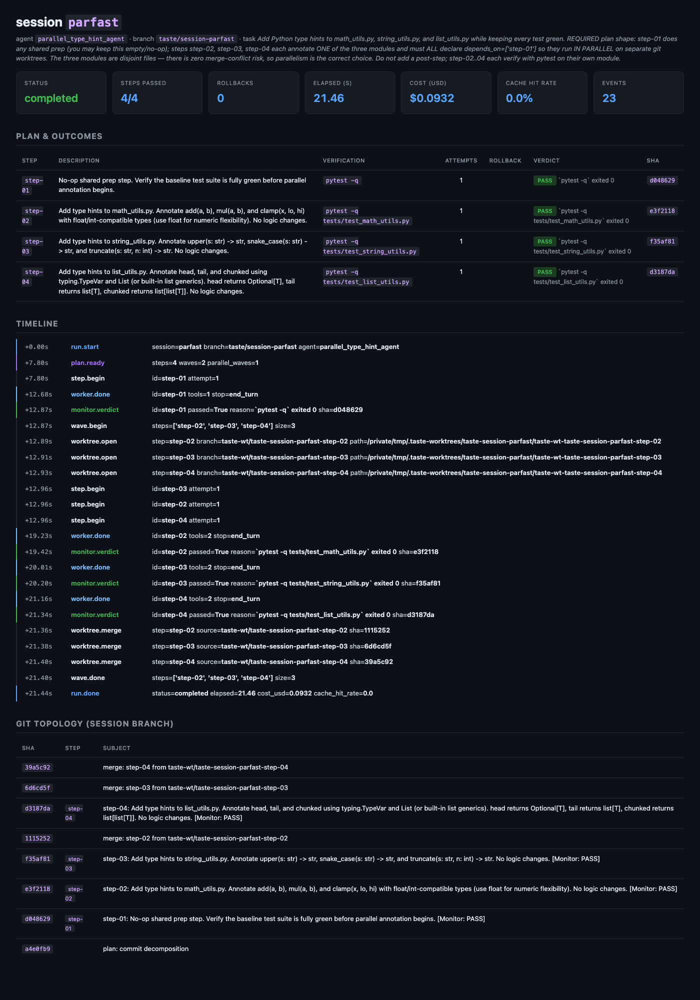
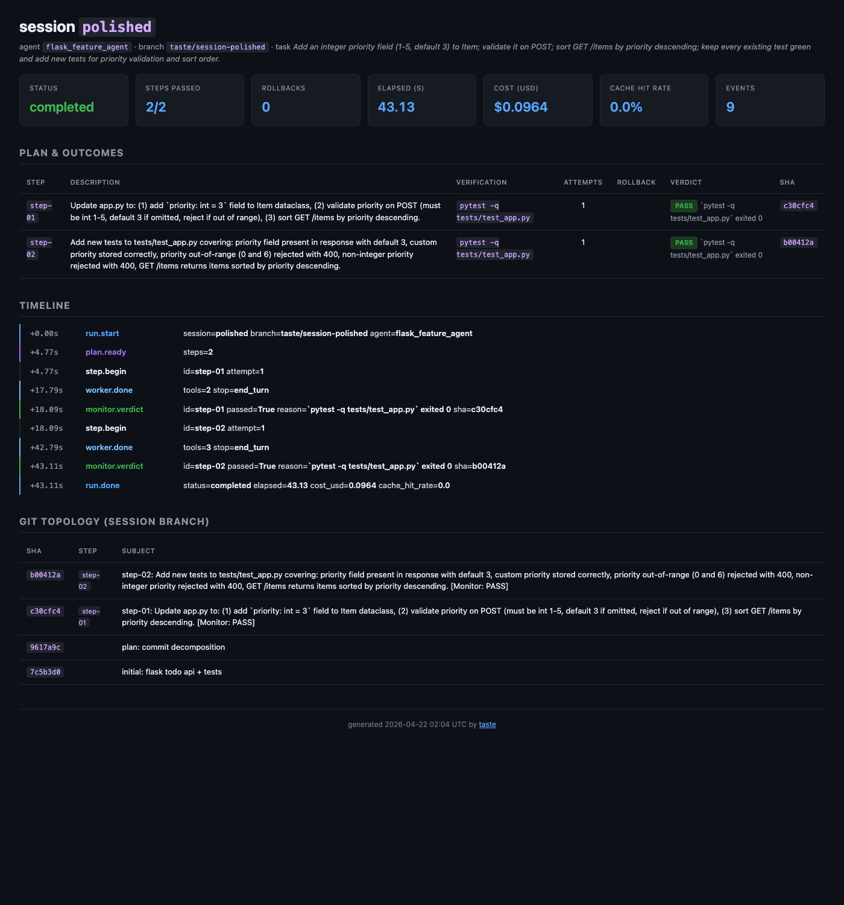
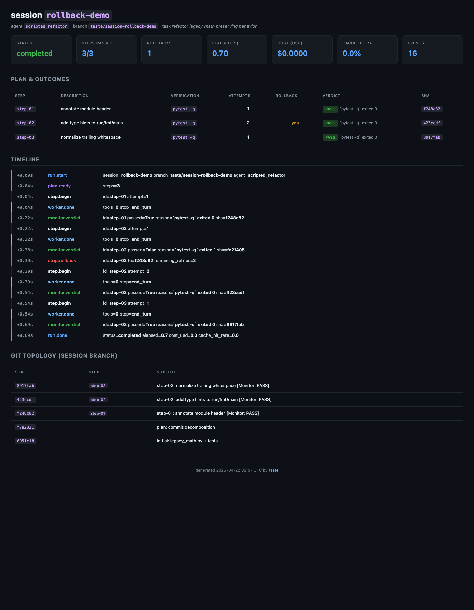

# taste is all you need

> **The harness, not the model, is where agents get their taste.**
> An Agent OS kernel that makes git the memory substrate, runs a Planner / Worker / Monitor split on top of it, and turns rollback from a last resort into a first-class primitive.

Full thesis: [Beyond the Harness: An Operating System for AI Agents](https://zanwenfu.com/blog/agent_harness_blog).

---

## The bet, in three bullets

1. **Git *is* the memory system.** Branches are execution contexts, commits are checkpoints, `git show` is demand paging, merge conflicts are coordination signals. Everything other harnesses bolt on as a sidecar (`progress.md`, compaction summaries, retry loops) is already a first-class primitive in git.
2. **Multi-core beats single-thread.** A Planner decomposes, Workers execute, a Monitor verifies — **each at a different model size**, each on its own commit boundary. Agents cannot grade their own exams; structural separation fixes that.
3. **Build to delete.** Every harness component is a bet against the model. When the bet expires — Opus 4.7 can self-evaluate, Sonnet 4.8 can plan 500 steps natively — you turn off the subsystem. The OS stays. The knobs change.

## Three demos

The repo ships with three demos, in the order a reviewer should read them:

- **[`examples/parallel_demo/`](examples/parallel_demo/README.md)** — a real **Claude** run where the Planner emits a DAG, the Kernel spawns **three worktrees in parallel**, and the Orchestrator merges all three branches back into the session. Wall-clock drops from ~32 s sequential to **21.5 s** on this task. [Transcript](examples/parallel_demo/runs/parallel.md) · [dashboard](examples/parallel_demo/runs/dashboard.html).
- **[`examples/todo_api/`](examples/todo_api/README.md)** — a real Claude run adding a validated `priority` feature to a small Flask API. Single-threaded path. [Transcript](examples/todo_api/runs/polished.md) ($0.0964, 43 s, 15/15 tests green).
- **[`examples/refactor_demo/`](examples/refactor_demo/README.md)** — hermetic scripted re-enactment of the *step-87 scenario*: step 2 silently regresses, the Monitor catches it via `pytest`, the Kernel rolls back, a retry lands clean. No API key required; CI asserts on the outcome.

### Real-model run (Milestone A) — $0.0964, 43 s, zero rollbacks

Full transcript: [examples/todo_api/runs/polished.md](examples/todo_api/runs/polished.md).

```
>> task=Add an integer priority field ... session=polished branch=taste/session-polished
PLAN steps=2
STEP id=step-01 attempt=1
WORK tools=2 stop=end_turn
EVAL id=step-01 passed=True  reason=`pytest -q tests/test_app.py` exited 0  sha=c30cfc4
STEP id=step-02 attempt=1
WORK tools=3 stop=end_turn
EVAL id=step-02 passed=True  reason=`pytest -q tests/test_app.py` exited 0  sha=b00412a
DONE status=completed elapsed=43.13 cost_usd=0.0964 cache_hit_rate=0.0
```

```
Model usage
┏━━━━━━━━━━━━━━━━━━━┳━━━━━━━┳━━━━━━━━┳━━━━━━━━┳━━━━━━━━━━━━┳━━━━━━━━━━━━┓
┃ model             ┃ calls ┃  input ┃ output ┃ cache read ┃ cost (USD) ┃
┡━━━━━━━━━━━━━━━━━━━╇━━━━━━━╇━━━━━━━━╇━━━━━━━━╇━━━━━━━━━━━━╇━━━━━━━━━━━━┩
│ claude-sonnet-4-6 │     7 │ 16,545 │  3,117 │          0 │    $0.0964 │
└───────────────────┴───────┴────────┴────────┴────────────┴────────────┘
```

The resulting session branch has exactly one commit per step. No sidecar files, no out-of-band state; `.taste/plan.json` and `.taste/monitor/<step>.json` are committed artifacts, so `git show taste/session-polished:.taste/plan.json` reproduces the plan. Read the transcript for the honest readout on what the run *didn't* yet prove (caching, long-horizon rollback, parallel execution).

### Hermetic rollback demo (no API key)

`pytest` is the Monitor. A scripted Worker plays out the *step-87 scenario*: step 2 silently regresses, the Monitor catches it via the project's own test suite, the Kernel rolls back, a retry lands the correct change. The final branch carries **no trace of the failed attempt** — the audit trail stays clean.

```bash
$ python examples/refactor_demo/simulate.py
>> task=refactor legacy_math.py preserving behavior session=0fb3a76e branch=taste/session-0fb3a76e
PLAN steps=3
STEP id=step-01 attempt=1
WORK tools=0 stop=end_turn
EVAL id=step-01 passed=True  reason=`pytest -q` exited 0  sha=d59174c
STEP id=step-02 attempt=1
WORK tools=0 stop=end_turn
EVAL id=step-02 passed=False reason=`pytest -q` exited 1  sha=4e88e78
REV  id=step-02 to=d59174c remaining_retries=2                       <-- rollback
STEP id=step-02 attempt=2
WORK tools=0 stop=end_turn
EVAL id=step-02 passed=True  reason=`pytest -q` exited 0  sha=d407440
STEP id=step-03 attempt=1
WORK tools=0 stop=end_turn
EVAL id=step-03 passed=True  reason=`pytest -q` exited 0  sha=f0d14fa
DONE status=completed elapsed=0.72
```

And the final git log — notice the zombie commit from the failed attempt is *gone*:

```
$ git -C <workspace> log taste/session-demo --oneline
de42e38 step-03: normalize trailing whitespace [Monitor: PASS]
7c266b0 step-02: add type hints to run/fmt/main [Monitor: PASS]
c70e9c0 step-01: annotate module header        [Monitor: PASS]
aa4355a plan: commit decomposition
ea7d6ab initial: legacy_math.py + tests
```

The plan itself is a committed artifact (`.taste/plan.json`); the Monitor's verdicts are committed JSON (`.taste/monitor/step-02.json`). No sidecar files, no out-of-band state — every decision the harness makes lives in the git history.

### Multi-core run (Milestone B) — parallel workers on real worktrees

```
$ taste run "...annotate three independent modules in parallel worker waves..."
>> task=... branch=taste/session-parfast agent=parallel_type_hint_agent
PLAN steps=4 waves=2 parallel_waves=1
STEP id=step-01 attempt=1                                  # wave 1 — sequential bootstrap
EVAL id=step-01 passed=True reason=`pytest -q` exited 0

WAVE.BEGIN steps=['step-02','step-03','step-04'] size=3    # wave 2 — parallel
WORKTREE.OPEN step=step-02 ...   WORKTREE.OPEN step=step-03 ...   WORKTREE.OPEN step=step-04 ...
WORK id=step-02 ...              WORK id=step-03 ...              WORK id=step-04 ...
EVAL id=step-02 passed=True      EVAL id=step-03 passed=True      EVAL id=step-04 passed=True
WORKTREE.MERGE step-02           WORKTREE.MERGE step-03           WORKTREE.MERGE step-04
WAVE.DONE steps=[02,03,04]
DONE status=completed elapsed=21.46 cost_usd=0.0932
```

Git graph on the session branch — diamond merges for each parallel worker branch:

```
*   merge: step-04 from taste-wt/...-step-04
|\
| * step-04: Add type hints to list_utils.py       [Monitor: PASS]
* |   merge: step-03 from taste-wt/...-step-03
|\ \
| * | step-03: Add type hints to string_utils.py   [Monitor: PASS]
| |/
* |   merge: step-02 from taste-wt/...-step-02
|\ \
| |/
|/|
| * step-02: Add type hints to math_utils.py       [Monitor: PASS]
|/
* step-01: shared prep                             [Monitor: PASS]
* plan: commit decomposition
* initial: three independent utility modules + tests
```

`Step.depends_on` turns a flat step list into a DAG. Steps with a shared dependency set form a **wave**; waves of size > 1 spawn a physical `git worktree` per step, run workers concurrently on a `ThreadPoolExecutor`, and only merge back if **every** worker in the wave passes its Monitor. `Memory.merge_branch` raises a typed `MergeConflict` (the blog's "merge conflicts are coordination signals" made literal). Wall-clock here: the three workers finished in ~8.5 s of real time vs ~25 s serial — **~60% wall-clock reduction** on this task.



### htop for agents (Milestone C)

Every run emits a JSONL event stream that [`taste dashboard`](taste/dashboard.py) rolls up into a self-contained HTML artifact — no server, no JS bundles, no external assets. The same file works as a commit-friendly portfolio artifact and as a live screenshot for talks.

| Real-model run (clean 2-step landing) | Hermetic rollback (step 2 FAIL → rollback → PASS) |
|---|---|
|  |  |
| [open](examples/todo_api/runs/dashboard.html) | [open](examples/refactor_demo/runs/dashboard.html) |

Generate one for any workspace you've run against:

```bash
taste dashboard --workspace /tmp/taste-todo   # writes .taste/dashboard.html
open /tmp/taste-todo/.taste/dashboard.html
```

The dashboard reads four runtime artifacts — `plan.json`, `monitor/*.json`, `.git/taste/events.jsonl`, and `git log` on the session branch — and renders them as a timeline, a per-step outcome table, and a git topology. The event log lives under `.git/` on purpose: inside the tracked tree it would get wiped by `git reset --hard` on rollback, destroying the trace of exactly the moment we most want to see.

## Architecture

```
                 ┌───────────────────────────────────────────────────────┐
                 │                       Kernel                          │
                 │   plan → waves of [ worker × N → monitor × N          │
                 │                    → integrate worktrees into session ]│
                 └─────────┬─────────┬────────────┬──────────────────────┘
                           │         │            │
                           ▼         ▼            ▼
                       Planner     Worker      Monitor
                      (Opus 4.7) (Sonnet 4.6) (Haiku 4.5)
                           │         │            │
                           └─────────┼────────────┘
                                     ▼
            ┌────────────────────────────────────────────────┐
            │                    Memory                      │
            │    branch   = process      │ commit = checkpoint│
            │    show     = paging       │ reset  = rollback  │
            │    worktree = address space│ merge  = IPC       │
            └────────────────────────────────────────────────┘
                                     ▲
                                     │
                                  Tools
                    native Python + lazy-loaded CLI descriptors
```

**On a step failure, the kernel does not simply retry.** It reads a fault
frame, names the fault against a deterministic rule table, and dispatches a
typed action — the trap-handler layer:

```
FAIL → observe (free)      exit code, diff, fingerprint, blast radius
     → probe  (free, $0)   was this check already failing before the step ran?
     → diagnose            12 rules, first match wins, zero model calls
     → decide              accept │ reverify │ retry │ repair │ rollback │ halt
```

Each module pulls one concept from the blog's OS analogy:

| File | Thesis role | What it owns |
|---|---|---|
| [taste/memory.py](taste/memory.py) | *Persistent storage + virtual memory* | Session branches, checkpoints, rollback, `git show` demand paging, worktrees, notes |
| [taste/cores.py](taste/cores.py) | *Multi-core CPU* | Planner / Worker / Monitor as pure functions over Memory |
| [taste/kernel.py](taste/kernel.py) | *Scheduler* | The orchestration loop; the only module that decides when to commit or roll back |
| [taste/recovery.py](taste/recovery.py) | *Trap handler* | Fault frame, failure taxonomy, rule table, action space, recovery policies |
| [taste/journal.py](taste/journal.py) | *Inode table* | One scannable card per checkpoint; attempt anchors that survive rollback |
| [taste/guardrails.py](taste/guardrails.py) | *Memory-protection bits* | Pre-execution veto on tool calls; substrate protection; budget ceiling |
| [taste/integrate.py](taste/integrate.py) | *Transaction commit* | Two-phase merge and the union gate over the combined tree |
| [taste/config.py](taste/config.py) | *Boot configuration* | `HarnessConfig` — every switch in one object, with a hash that names the arm |
| [taste/agent.py](taste/agent.py) | *Package manager* | `agent_desp.md` parsing, `@agent` decorator, global registry |
| [taste/tools.py](taste/tools.py) | *Syscalls* | Native Python tools **and** filesystem-walked CLI tools (98.7% token pattern) |
| [taste/llm.py](taste/llm.py) | *I/O layer* | Model client with prompt caching, retries, per-role cost telemetry, budget caps |
| [taste/cli.py](taste/cli.py) | *Task manager* | `taste run` / `log` / `index` / `card` — htop for agent runs |
| [taste/memstore/](taste/memstore/) | *Persistent storage, second generation* | `Store` / `Branch` over git: leases, atomic checkpoints, publish / catalog / search, typed merges whose conflicts are values, verdicts, inboxes. Importable without the kernel line (`tests/test_package_isolation.py`) |
| [taste/brains/](taste/brains/) | *Multi-process scheduler* | One OS process per worker, on its own worktree and memstore branch. A central planner writes immutable plan revisions, a supervisor spawns and reaps, one monitor per worker judges and files verdicts without acting, `delivery.py` projects a pinned worker state into the integration branch |

None of these modules import each other in a cycle, and **every subsystem
above the kernel is off by default**. That is not a disclaimer, it is the
central discipline: each one is a bet against the model, so each must be
independently removable. A test asserts that the default configuration
reproduces the original kernel's event stream and commit chain exactly —
"build to delete" is a checked property here, not an intention.

```python
Kernel(workspace=ws, config=HarnessConfig.arm("full"))   # everything on
Kernel(workspace=ws)                                      # the original kernel
compose_central_runtime(repo, session, goal).run(          # the multi-process runtime; library only, no CLI yet
    max_generations=8, wall_clock_seconds=900.0)           # bounds are required; an unbudgeted goal has no other limit
```

### Separate Azure OpenAI worker harness

The Claude Agent SDK harness remains available through
`taste.brains.worker_entrypoint` and `taste.brains.worker_launch`. The opt-in
Azure Responses harness uses `taste.brains.azure_worker_entrypoint` and the
`worker_command_factory` in `taste.brains.azure_worker_launch`, passed to
`SubprocessLauncher`. It does not import the Claude Agent SDK. Install the
`openai` extra and supply `AZURE_OPENAI_BASE_URL` and `AZURE_OPENAI_API_KEY` in the
launch environment; each immutable Assignment must carry its matching
`AzureWorkerPolicy`, worker/monitor budgets, call limits and absolute deadline.
Personal OpenAI and Anthropic credentials are not fallback routes.

The Azure worker supports confined artifact tools, explicit feedback acceptance,
private model-call accounting, exact-state monitor certification, and coordinator
delivery. `compose_azure_central_runtime` in `taste.brains.azure_central_host`
wires the Azure planner and worker launcher together. Its `AzureExecutionPolicy`
pins the routes, call limits, worker/monitor budgets, pricing table and absolute
deadline into the immutable goal. The planner must propose assignments matching
that policy. The host owns and closes its private planner SDK client.

For a separate goal process, `prepare_azure_goal_process` in
`taste.brains.azure_goal_entrypoint` returns the exact `GoalProcessInput` without
model calls. Persist its bytes outside task write access, hash them with SHA256,
and use `azure_goal_command(input_path, digest, mode="run")` to build the isolated
command. `mode="settle"` reconciles the same admitted goal without provider
credentials and refuses new model calls or worker launches. The caller must own an outer process scope that enforces a
hard deadline and confirms all descendants have stopped. The historical Claude
goal and worker entrypoints remain separately available.

`OwnedProcessScope` can deliver private files through systemd `LoadCredential`.
Add `ScopeCredential` name/digest descriptors to its `ScopeSpec` and pass the
matching byte mapping to `OwnedProcessScope.create(..., credentials=...)`.
The controller snapshots those bytes outside worker write access and validates
the files and every path ancestor before launch. Only names and digests enter
the saved specification; secrets never enter service arguments or environment
values. The service reads its read-only copies through `CREDENTIALS_DIRECTORY`.
The owner retains its private snapshots for recovery and must remove them when
the trial is settled. Credential-free scope records retain their existing format
and digests. `scripts/check_scope_credentials.py` checks actual unprivileged
delivery, deadline cleanup, lost-acknowledgement recovery and the Azure credential
loader using dummy bytes. The loader admits either a private service-owned copy
or systemd's root-owned copy with exactly one ACL reader for the service UID.

For the standalone Azure command, encode the exact prepared input's API key and
optional terminal issuer with `encode_azure_goal_credentials` in
`taste.brains.azure_goal_credentials`. Deliver those bytes as the scope credential
`taste-azure-goal.json` and call `azure_goal_command(..., systemd_credentials=True)`.
The goal validates the private input binding and probes terminal issuer readiness
before the first paid plan. A failed or cancelled probe cannot dispatch a goal.
Workers receive their own assignment grants and Azure authentication; the
coordinator's credential-directory hint is removed at their process boundary.
Preparation and settlement require no provider or terminal credentials.

`AzureGoalService` in `taste.brains.azure_goal_service` binds these operations to
an `OwnedProcessScope` and a durable result exchange. `create(...)` admits a
fresh `prepare`, `run`, or `settle` service; `run(timeout_seconds=...)` launches
it once, while `recover()` only drains and inspects the original service.
Results are read after confirmed whole-scope drainage, with exact input,
operation, goal identity and cost-accounting checks. A missing result remains
incomplete; after drainage, use a separate credential-free settlement operation.
An ambiguous launch stays fenced even if a result file exists. The owner must
protect input, scope and exchange paths from model writes. Only a `run` service
receives the private Azure credential. Place the fresh workspace in a separate
service-owned state directory: memory worktrees are created beside the workspace.
Preparation rejects an unwritable parent before initializing Git.
`grading_ready()` admits settled bounded
outcomes with known spending; benchmark reward still comes from the verifier.
`scripts/check_azure_goal_service.py` exercises real Linux services for completion,
a lost provider reply and SIGKILL during dispatch using mocked HTTP and no paid
calls. Its independent `--cleanup-only` command drains the recorded scopes.

An existing or partly initialized worker run is refused by the fresh-launch
entrypoint; it never resets the allowance on restart. A native Harbor agent now
runs benchmark tasks as goals with real models (next section). No full or scored
benchmark run has been made.

#### Running a Harbor benchmark task

`taste.benchmarks.harbor_agent:TasteAgent` runs one benchmark task as a goal in
Harbor's standard Docker environment, as the task is published: no environment
subclass, extra Compose file, mount or override. The coordinator, its workers
and their monitors run on the host; only shell commands enter the task
container. Procedure, settings and what has been validated are in
[`infra/azure/benchmarks.md`](infra/azure/benchmarks.md).

- Every worker is shown the task verbatim before its assignment. The
  coordinator writes the final reply. When time, budget, the generation bound
  or planner failures end a run first, it writes a closing reply from the
  evidence it has, inside a reserved part of the trial's time.
- A command that outlives its timeout is ended alone, with its child processes.
  The container stays usable.
- The trial leaves one ATIF trajectory in the order things happened: the
  instruction, every worker step with one tool call each, then the reply.
  Planner and monitor calls stay in the private record with every model
  receipt and the terminal ledger.
- The trial is handed to the benchmark's verifier whatever this system's own
  audit found. Missing evidence or unsettled cost is recorded as `audit_flags`
  in the trajectory and the trial metadata. It is never used to withhold a task
  from grading. A run cancelled by the benchmark's own time limit is sealed
  first and graded as a timeout.

For [Errata Bench](https://errata-bench.vercel.app/docs) this has been run with
real models on a handful of tasks (see the guide for the list and the
measurements). Errata's own unpaid admission check counts those trials as
gradable and official. No full run and no paid grading has been made, and
Terminal-Bench is not supported: its official runs use a sandbox this terminal
transport cannot reach.

`AzureTerminalTrial` in `taste.benchmarks.azure_terminal_trial` owns an Azure goal
and an already admitted Docker task container. `create(...)` persists their
original identities and limits in a private controller directory. `run(api_key=...)`
prepares the goal, issues private terminal grants, runs it in a separate
unprivileged service, drains that service and settles without credentials before
sealing the live container for grading. Unknown spending and incomplete
evidence are recorded as `audit_flags` and do not withhold grading. The
container deadline may extend beyond the agent deadline to allow the verifier
and output downloads to finish; neither deadline is renewed on recovery.
Call `release()` to hand the sealed container to a runner that verifies and
removes it itself, or `close()` to stop it after grading or on failure. For
native Compose bindings,
cleanup also handles Harbor having removed the original container: it requires
an explicit daemon absence response and an empty original cgroup. A failed
daemon request or a live cgroup cannot establish successful cleanup.
An independent watchdog must call `cleanup_trial(directory)` after controller
death. It drains the saved scopes and original container, removes the private
launch credential and preserves pending terminal receipts without replay.
Drainage alone does not settle an interrupted goal's spending.

The controller-side `DockerTerminalBackend` in `taste.brains.docker_terminal`
implements bounded non-TTY terminal transport over an explicit local Docker
socket (API v1.51, Linux cgroup v2). It binds the full container ID, original
start time and either a reserved ownership label or Harbor's native Compose
project/main-service identity and exact image ID. A fixed admitted execution
user preserves Harbor's agent-user setting without a task override. It captures
bounded binary stream prefixes with
durable dropped-byte counts, and confirms exit status through Docker's exec API.
Stopping requires an empty original cgroup and a stopped container (or confirmed
removal for a native Compose binding).
Persist the original `DockerTerminalBinding` outside task write access for recovery.
The lifecycle owner must create the isolated container with restart disabled
and independently stop/remove it if the controller dies. Workers must not receive
the Docker socket. `scripts/check_docker_terminal.py` exercises this transport in
five serial disposable containers; its invocation documents the outside cleanup
requirement.

`scripts/check_native_harbor_terminal.py` checks native Harbor container labels,
configured non-root user, working directory, resource limits, standard log
mounts, shared verification and controller-death cleanup without an environment
subclass or extra Compose file. It is a synthetic terminal integration check;
it does not exercise model-only egress or claim an official benchmark score.

`TerminalService` and `TerminalClient` in `taste.brains.terminal_service` connect
workers to that broker over a bounded Linux Unix-socket protocol. Peer UID checks
and a private random bearer token bind each worker to its immutable assignment,
task container and original deadline. A command that outlives its timeout, or
whose caller disconnects, is ended alone with its child processes and recorded
as a completed receipt; a transport that cannot end one command stops the whole
environment instead. A completed request can be looked up without running it
again. The broker serializes all workers' terminal effects in the same container.

To admit terminal tools, set `AzureExecutionPolicy.terminal` to the public
`TerminalWorkerPolicy` and give `compose_azure_central_runtime` a trusted
`terminal_credential_provider`. For each prepared launch, that callback must
register the matching `TerminalCredential` with the service before returning it.
Credentials are installed in private files outside model-visible memory; the
worker verifies them and probes the service before paid admission. It receives
`terminal_exec` and `read_terminal_output`, with bounded pages and explicit
truncation counts. Files, packages and services in the container persist across
memory rollback. Omitting the terminal policy preserves artifact-only execution.

For a separate coordinator process, `TerminalIssuerClient` supplies this callback
over the same socket using a distinct private `TerminalIssuerCredential`.
The broker checks the coordinator UID, exact goal-input digest and terminal
policy, derives each actor from its assignment, and refuses changed checkpoints,
expired deadlines or new grants after sealing. Worker tokens cannot issue grants;
the issuer token cannot execute commands. A repeated issuance request returns
the same token only within that service lifetime. Service loss still requires
outside cleanup and recovery rather than restarting workers speculatively.

The standalone Azure goal CLI can load the issuer callback, but the outside
lifecycle owner must still create the task container and broker, enforce the process
deadline, drain agent processes, and call `TerminalService.seal_for_grading()`
before grading the live task. Sealing refuses an active or uncertain command,
permanently blocks new effects (including after broker recovery), and leaves
completed receipts readable. Task background services remain part of the live
environment. Call `close()` after grading or on failure; an independent owner
must still stop/remove the container if the controller dies.
`scripts/check_terminal_service.py` validates the broker with two serial
containers and unprivileged worker processes, including grading a fixture after
sealing and killing a worker during a command. These checks do not yet constitute
a Harbor adapter or an official Terminal Bench result.

The fixture scripts described from here on (`check_terminal_service.py`,
`check_terminal_broker.py`, `check_harbor_trial.py`, `check_azure_harbor.py`,
`check_harbor_separate.py`) were written before command-scoped timeouts,
plain-text terminal results and always-grade settlement. They have not been
re-run since, and at least three of them assert the earlier behaviour.
`check_docker_terminal.py` is current and was re-run against a real daemon.

`scripts/check_harbor_trial.py` exercises the pinned Harbor revision
`d611f10b15ffab8afb7b665b3e69e96773044fc8` in a separate server environment.
It runs a controlled local task through Harbor's actual Trial and verifier with
an unprivileged scripted worker. The success case requires reward `1.0`; the
worker-death case requires an exception and no reward. Every case requires broker stop
proof before container removal, an empty original cgroup, and retention of the
cached image. Run each mode in a bounded systemd unit with the independent
owner-label cleanup described in the script. Telemetry is disabled and no image
pulls or paid calls occur. This validates the grading/cleanup handoff for that
fixture.

`scripts/check_azure_harbor.py` connects the actual Azure planner, workers,
monitors, issuer and `AzureTerminalTrial` to the same pinned Harbor Trial and
official verifier. Only provider HTTP is mocked. Its modes cover completion,
worker death after a terminal effect, a lost planner reply, and verifier output
collection after the agent deadline. `killed-owner` kills the Harbor/controller
process during an active terminal command; run its independent `--cleanup-only`
command through systemd `ExecStopPost`, then use `--observe-owner-death` to check
drainage and retained uncertainty. Use a fresh 32-character hex owner token per
case and keep the Harbor and Azure Python environments separate. These controlled
fixtures do not yet admit arbitrary Terminal Bench tasks or produce benchmark
scores.

`scripts/check_harbor_separate.py` extends this lifecycle to a second, separately
owned verifier container. The actual Harbor collector transfers a regular file,
a directory containing binary data, and the conventional artifacts directory.
`ArtifactHandoff` requires successful bounded captures **and** a complete matching
Harbor collection manifest, then checks the captured bytes before verifier
uploads. Missing files, links, altered bytes and failures after a successful copy
prevent verifier creation. A valid reward is withheld if verifier cleanup fails;
zero is a valid reward, while missing and non-finite rewards remain errors.
The `kill-copy` and `kill-verifier` modes require independent `--cleanup-only`
execution through `ExecStopPost`, followed by `--observe-owner-death`. Both original
container identities must drain, even when the controller dies during artifact
capture or verification. The trusted test script is installed during controlled
fixture setup; this does not validate released task images or general task
admission. Each case uses the cached image, no task network and no paid calls.

The same fixture's `service-*` modes add a helper service with its own filesystem
and original Docker identity. The real terminal action writes to that service
over a private loopback connection; the main container has no external network.
Before helper artifacts are copied, `ArtifactHandoff.drain_main()` confirms the
original main container has stopped. Failed stop attempts, restarted services or
incorrect service names cannot yield valid evidence, even when Harbor continues
after an error. Receipts bind each capture to its service and original container;
limits apply across services, and overlapping verifier paths are rejected.
Helper cleanup must also complete before verifier creation. The modes
`kill-service-copy` and `kill-service-verifier` exercise independent cleanup after
controller death. Cleanup of a restarted helper retains the identity conflict
and records removal separately; the restarted service is never re-admitted for
collection. Released-task collection hooks, filtered/mode-preserving output
and general service topology still require admission and validation.

These fixtures export logs, artifacts and rewards through
`taste.benchmarks.output_snapshot`, with no host output mounts. It checks the
original Docker identity before and after a bounded archive download, validates
all entries before writing, and creates only ordinary files. Directory snapshots
require an empty private destination; individual files require an unused name in
a private parent. Links, special/sparse files, path escapes, duplicates, stale output
and excess data are refused. Defaults cap archives at 16 MiB, individual files
at 4 MiB, total file data at 8 MiB and entries at 1,024. These are explicit
admission limits, not silent truncation. Additional real fixture modes
`reward-symlink`, `reward-fifo` and `reward-oversize` require a verifier download
error and no reward. The controller must retain ownership of in-flight copies
through cancellation and must not grade a failed snapshot. Artifact handoffs also
cap aggregate file bytes and entries across all declared outputs. Source modes
and ownership are not applied to host files. Larger outputs, executable-mode
preservation, links, arbitrary destinations and filtered downloads need explicit
admission before running tasks that require them.

## Quickstart with a real Claude

The current Linux regression environment uses Python 3.14.4. In a clean Python
3.14 environment, reproduce its dependency versions with:

```bash
python -m pip install -c requirements-brains-lock.txt -e '.[dev,brains]'
python -m pip check
```

The historical `requirements-lock.txt` belongs to the earlier kernel experiments.
The brain SDK's executable admission and benchmark environment checks are
separate from installing Python dependencies.

```bash
# One-time
conda create -n agent-os python=3.11 -y
conda activate agent-os
pip install -e '.[dev,brains]'

export ANTHROPIC_API_KEY=sk-ant-...

# Bootstrap a throwaway workspace and run
python examples/refactor_demo/bootstrap.py /tmp/refactor-demo
taste run "add type hints to legacy_math and split run() into small helpers, keeping all tests green" \
    --agent examples/refactor_demo/agent_desp.md \
    --workspace /tmp/refactor-demo
```

Inspect afterwards with the same navigable state the kernel used:

```bash
git -C /tmp/refactor-demo log taste/session-<id> --oneline --graph
git -C /tmp/refactor-demo show taste/session-<id>:.taste/plan.json
git -C /tmp/refactor-demo show taste/session-<id>:.taste/monitor/step-02.json
```

## The 50-LOC-plus-markdown agent

```markdown
<!-- examples/refactor_demo/agent_desp.md -->
---
name: python_refactor_agent
description: Refactors Python modules while preserving behavior.
tools: [read_file, write_file, run_shell]
model: claude-sonnet-4-6
triggers: ["refactor", "type hints", "split function"]
---

You are a careful Python refactoring agent. You preserve public APIs, keep
tests passing, and never introduce new dependencies without permission.
```

```python
# examples/my_agent.py  (not required for the refactor demo, but this is the DX target)
from taste import agent

@agent(config="agent_desp.md")
def python_refactor_agent(task: str) -> str:
    """The spec provides everything. The function is optional glue."""
```

## Tests

```bash
pytest -v
```

1,576 tests, none of which need an API key; the brain-layer tests skip without the `brains` extra. The load-bearing ones:

```
tests/test_kernel_rollback.py   step-87 rollback story (real pytest as Monitor)
tests/test_memory.py            git primitives + worktrees + merge conflict as typed exception
tests/test_parallel.py          parallel waves, atomic merge, event stream integrity
tests/test_recovery.py          fault frame, rule table, action space, arms, baseline probe
tests/test_guardrails.py        tool veto, substrate protection, budget ceiling, fail-open
tests/test_integrate.py         two-phase merge; a semantic conflict git happily merges
tests/test_journal.py           checkpoint cards, anchors, index; and that OFF writes nothing
tests/test_golden_baseline.py   the frozen run signature every subsystem must reproduce when off
tests/test_cores_worker_loop.py the model-facing tool loop, driven by a scripted LLM
tests/test_memstore_store.py    the memory layer's invariants: nothing is lost, a checkpoint is atomic, the store is the truth
tests/test_memstore_audit.py    one test per defect an independent audit found; every one failed before its fix
tests/test_brains_launch_integration.py  a real launcher driving a real worker entrypoint in a subprocess, no API key
```

If those go green, the core claims of this repo are empirically true, not just
argued. `tests/golden.py` is worth a look on its own: it reduces a run to a
fingerprint — event-kind sequence, payload keys, commit chain, per-step
outcomes — with SHAs and timings excluded, so "this subsystem changes nothing
when disabled" is a single assertion rather than a hope.

## What's shipped vs what's next

**Shipped:**

| Milestone | Deliverable |
|---|---|
| A — Credibility | Real Claude end-to-end, recorded transcript ([todo_api/runs/polished.md](examples/todo_api/runs/polished.md)), cost + token telemetry surfaced, planner hardened against weak verifications |
| B — Multi-core | `Step.depends_on` DAG, `Memory.add_worktree` / `merge_branch` / `MergeConflict`, Kernel parallel wave execution, recorded parallel run ([parallel_demo/runs/parallel.md](examples/parallel_demo/runs/parallel.md)) |
| C — Transparency | JSONL event stream (outside tracked tree to survive rollback), self-contained HTML dashboard, `taste dashboard` CLI command, [screenshots](docs/img/) |
| D — Recovery | A step failure became a *fault*: `taste/recovery.py` reads a fault frame, names it against a 12-rule deterministic table at zero model cost, and dispatches one of seven typed actions. Recovery policies are configuration, so the same kernel expresses self-verification, repair-in-place, rollback, and an attempt-matched no-reset control |
| E — Memory & protection | `taste/journal.py` — a scannable card per checkpoint in git notes, plus attempt anchors that keep a rolled-back attempt readable. `taste/guardrails.py` — pre-execution veto on tool calls, substrate protection, per-step budget ceiling |
| F — Integration | `taste/integrate.py` — two-phase merge (compute in the object store, verify, then move refs) and a union gate that catches combinations which merge cleanly and break anyway |
| G — Multi-process | `taste/memstore/` + `taste/brains/`: a central planner (Opus) plans, a supervisor runs one worker process (Sonnet) per branch with an observe-only monitor (Haiku) beside it, certified artifacts are projected into an integration branch. Measured: a one-file goal in 60 s with one worker; a two-file goal with a dependency in 132 s with two. Library only; no CLI yet |

**Deliberately held back:**

- **Inter-agent communication.** Built at the memory level: `Store.send` / `Store.inbox`, made typed and generation-fenced in [taste/brains/communication.py](taste/brains/communication.py). Only the central ↔ worker path uses it. A worker still cannot ask for data another worker produced: `store.catalog()` and `store.search()` have writers and no production readers. Free-form agent-to-agent chat is still rejected outright, because nothing should cross an agent boundary that a Monitor has not passed.
- **Agent provisioning.** Fetching an agent definition from the internet and feeding it to a worker's system prompt is remote code execution with extra steps. Not built, and not planned until execution is containerized.
- **LLM merge resolution.** `git merge-tree` computes conflicts exactly and for free; a model asked to *resolve* one over-merges, inventing a combination no step produced — which is precisely the contamination this harness exists to detect.
- **The guardrail boundary is a speed bump, not a sandbox.** A denylist over a shell string is defeated by `sh -c`, `eval`, or a variable. It catches the common accidental case and records every attempt. The real boundary is a container with no network and no `.env` in scope. The same holds for [taste/brains/jail.py](taste/brains/jail.py); there the real boundary is the SDK's OS-level sandbox.
- **Long-horizon real-model rollback.** The step-87 story is proven hermetically; reproducing it with a real model requires a task hard enough that it reliably stumbles.

Everything on the "held back" list can be added without breaking the kernel's public API — that's what *build to delete* buys you.

**Known, not yet fixed:**

- **Proven on one shape of goal.** The end-to-end run writes one small file. Whether a planner that has been told what a worker can do keeps writing achievable contracts for genuinely multi-step work is untested, and it is the next thing that would break.
- **No CLI for the multi-process layer.** `taste run` drives the kernel line; the central brain is a library, composed in Python.

## Run this against your own agent

Adapt `examples/refactor_demo/` as a template:

1. Drop an `agent_desp.md` describing your agent's capability and tools.
2. Register it with `@agent(config="agent_desp.md")` or hand the path to `AgentSpec.from_file`.
3. `taste run "<task>" --agent <spec> --workspace <repo>`.
4. Every step becomes a commit. Rollback is free. The Monitor is your existing test suite.

## License

MIT — see [LICENSE](LICENSE).

## Citation / credit

The thesis is laid out in [Beyond the Harness](https://zanwenfu.com/blog/agent_harness_blog). This repo is the first pass at a runnable artifact for it. Feedback, counter-examples, and failure modes are wanted — open an issue or reach [Zanwen Fu](mailto:zanwen.fu@duke.edu).
