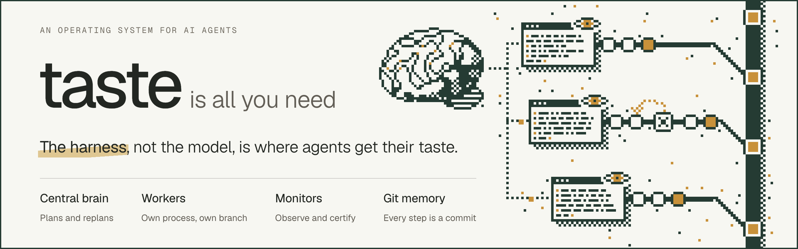
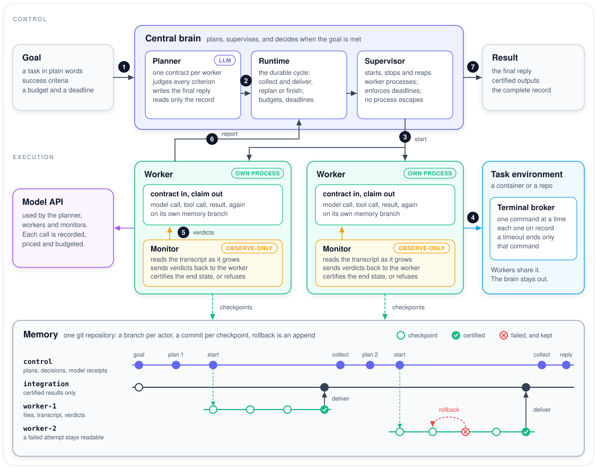

<a href="https://zanwenfu.com/blog/agent_harness_blog">
<picture>
  <source media="(prefers-reduced-motion: reduce)" srcset="docs/img/banner.png">
  <source media="(prefers-color-scheme: dark)" type="image/avif" srcset="docs/img/banner-dark.avif">
  <source type="image/avif" srcset="docs/img/banner.avif">
  
</picture>
</a>

[](https://github.com/zanwenfu/taste-is-all-you-need/actions/workflows/ci.yml)
[](https://github.com/zanwenfu/taste-is-all-you-need/releases)
[](LICENSE)


Taste is an operating system for AI agents. You give it a goal. A **central
brain** breaks the goal into contracts, a separate **worker** process carries
out each contract, an observe-only **monitor** checks every worker and
certifies what it finished, and every plan, model call, command, verdict and
rollback is a commit in one **git repository**. Work that was not certified
is never delivered, and nothing that happened is ever lost.

<picture>
  <source media="(prefers-color-scheme: dark)" srcset="docs/img/architecture-dark.svg">
  
</picture>

The idea behind it: [Beyond the Harness: An Operating System for AI Agents](https://zanwenfu.com/blog/agent_harness_blog).

## How a goal runs

The numbers match the figure.

1. **A goal comes in**: a task in plain words, the criteria that must hold at
   the end, a budget and a deadline. It is recorded before anything else
   happens.
2. **The planner writes a plan**: one contract per worker, saying what to do,
   what to produce, and how its monitor will know it is done. The planner
   reads only what is on record, never a worker's private context.
3. **The supervisor starts a worker for each contract**, as its own
   operating-system process on its own branch of memory.
4. **The worker works**: model call, tool call, result, again. When it acts on
   a shared environment, each command goes through a broker that runs one at a
   time and records every one.
5. **A monitor watches**. It reads the worker's transcript as it grows and
   sends back verdicts the worker has to answer. When the worker claims it is
   done, the monitor certifies the end state against the contract, or refuses.
6. **The report comes back**. Certified outputs are delivered into the
   `integration` branch. A failure, a refusal or a stopped worker is a reason
   to replan, not a reason to stop.
7. **The planner replans or finishes**. When every criterion is met it writes
   the final reply. If time or budget runs out first, it writes a closing
   reply that says what was done and what was not.

A longer walk-through, with the rules that hold the parts together, is in
[docs/architecture.md](docs/architecture.md).

## Why build it this way

**Git is the memory.** A branch is an agent's context, a commit is a
checkpoint, a rollback is a new commit that restores an earlier state. What
other harnesses add as side files (progress notes, summaries, retry logs) is
already there, with history, diffs and merges for free.

**Whoever does the work does not grade it.** Planning, doing and checking are
separate roles with separate contexts. A worker's claim is not evidence; a
monitor's certificate of the exact end state is.

**Every part is a bet against the model, so every part can be removed.** As
models improve, a subsystem that no longer pays for itself is switched off.
The operating system stays.

| Operating system | In Taste | Code |
| --- | --- | --- |
| Scheduler | the central brain: planner, runtime, supervisor | `taste/brains/central_*.py`, `supervisor.py` |
| Process | a worker, one per contract | `taste/brains/*worker_runtime.py` |
| Watchdog | a monitor per worker | `taste/brains/monitor*.py` |
| File system and virtual memory | the git-backed store | `taste/memstore/` |
| Inter-process communication | typed messages and verdicts | `taste/brains/communication.py` |
| System calls | tools, and the terminal broker | `taste/brains/terminal_*.py`, `artifact_tools.py` |
| Accounting | priced, journaled model calls and budgets | `taste/llm.py`, `taste/pricing.py` |

## What it gives you

- **Nothing is lost.** A rollback appends. A failed attempt keeps its files,
  its transcript and the reason it failed.
- **Nothing unverified is delivered.** Only work a monitor certified reaches
  the `integration` branch.
- **Every effect is on record, once.** A model call, a process start, a
  command and a delivery are each recorded before and after they happen. After
  a crash they are looked up, not repeated, and a paid reply is never paid for
  twice.
- **Spending is bounded.** Each model call is admitted against what is left
  of the budget at its worst-case price, and a goal that reaches its spend cap
  takes on no more work and gives its reply.
- **A stuck command does not take the task with it.** A command that outlives
  its timeout is killed with the processes it started. The environment stays
  usable and the output it had printed is kept.

## Try it

Python 3.11 or newer, and git.

To use it as a library, install a release. The name `taste` on PyPI belongs
to an unrelated project, so install from the tag:

```bash
pip install "taste[all] @ git+https://github.com/zanwenfu/taste-is-all-you-need@v0.2.0"
taste --version
```

To run the demos below, or to work on the code, clone it:

```bash
git clone https://github.com/zanwenfu/taste-is-all-you-need
cd taste-is-all-you-need
pip install -e '.[dev]'
```

| Extra | Adds |
| --- | --- |
| `brains` | the Claude Agent SDK worker harness |
| `openai` | the Azure OpenAI worker harness |
| `all` | both |
| `dev` | pytest and ruff |

**See a rollback, no API key needed.** A scripted worker breaks the tests on
its second step; the monitor catches it, the kernel rolls back, and the retry
lands clean.

```bash
python examples/refactor_demo/simulate.py
```

```
STEP id=step-02 attempt=1
EVAL id=step-02 passed=False reason=`pytest -q` exited 1  sha=4e88e78
REV  id=step-02 to=d59174c remaining_retries=2                       <-- rollback
STEP id=step-02 attempt=2
EVAL id=step-02 passed=True  reason=`pytest -q` exited 0  sha=d407440
```

**See the memory layer on its own.** Two branches: one publishes a result,
the other finds it, uses it, fails, and rolls back with nothing lost.

```bash
python examples/memstore_demo.py
```

**Run a real task** with Claude through the single-process kernel:

```bash
export ANTHROPIC_API_KEY=...
python examples/refactor_demo/bootstrap.py /tmp/refactor-demo
taste run "add type hints to legacy_math and split run() into small helpers, keeping all tests green" \
    --agent examples/refactor_demo/agent_desp.md --workspace /tmp/refactor-demo
taste dashboard --workspace /tmp/refactor-demo      # one self-contained HTML page of the run
```

**Run the multi-process runtime** from Python. It needs the `brains` extra
(`pip install -e '.[dev,brains]'`) and `ANTHROPIC_API_KEY`:

```python
from pathlib import Path

from taste.brains.central_host import compose_central_runtime
from taste.brains.central_planner import Goal

workspace = Path("/tmp/taste-workspace")
workspace.mkdir(exist_ok=True)
goal = Goal(goal_id="demo", task="Write hello.txt containing the word hello",
            success_criteria=("hello.txt contains the word hello",))
with compose_central_runtime(workspace, "demo-session", goal) as host:
    outcome = host.run(max_generations=8, wall_clock_seconds=900)   # both bounds are required
print(outcome.stop_reason, outcome.complete)
```

**Run a benchmark task.** `taste.benchmarks.harbor_agent:TasteAgent` runs a
Harbor task as a goal, in the benchmark's own container. Setup, settings and
measurements are in [infra/azure/benchmarks.md](infra/azure/benchmarks.md).

## Status

This is research software at an early stage. What has been shown, and how:

| Part | Evidence |
| --- | --- |
| Memory layer | Its own test suite, including one test for every defect an independent audit found, and a crash-consistency demo. |
| Single-process kernel | Recorded real runs with Claude ([feature added in 43 s for $0.10](examples/todo_api/runs/polished.md), [three workers in parallel](examples/parallel_demo/runs/parallel.md)) and the rollback demo above, which CI runs on every push. |
| Multi-process runtime | About 3,000 tests that need no API key, on Python 3.11, 3.12 and 3.14. With real models: 29 trials of 16 [errata-bench](https://errata-bench.vercel.app/docs) tasks, all accepted by that benchmark's own admission check. |
| Agents written by others | [mini-swe-agent](https://github.com/SWE-agent/mini-swe-agent) runs unchanged as a worker: a test finds its requests, messages and commands the same as under its own model class. Two drill trials of one Terminal-Bench 2.1 tuning task, every role on GPT-5.6 Luna, both passed by the task's verifier. |

What it has **not** shown yet: a full benchmark run or any score, more than
one worker at a time on a shared task container, rollback of the task
environment, and whether supervising an agent helps it. The runtime is a
library; the `taste` command drives only the single-process kernel.

Open problems and next steps are tracked as
[issues](https://github.com/zanwenfu/taste-is-all-you-need/issues).

<details>
<summary><b>Measurements from the real-model trials</b></summary>

One coordinator, one worker at a time, the same model in every role
(gpt-6-astra on Azure OpenAI), each trial inside a 30-minute limit.

| Task size | Time | Cost | Plans |
| --- | --- | --- | --- |
| Small instruction (2 to 10 KB), three tasks | 80 to 144 s | $0.89 to $1.72 | 2 |
| Large instruction (117 KB), twice | 263 and 275 s | $4.27 and $4.46 | 2 |

The same runs were used as drills: the benchmark's own time limit cancelling
the agent, working time running out, two attempts of one task at once, and a
command that ignores termination. Each ended in a record the benchmark could
grade.

</details>

## The single-process kernel

The project started as one loop: a planner, a worker and a monitor as
functions, a commit after every step, and a rollback when a check fails. That
kernel still backs the `taste` command and the three demos.

| Demo | What it shows |
| --- | --- |
| [`examples/refactor_demo/`](examples/refactor_demo/README.md) | A regression caught by the project's own tests and rolled back. Hermetic. |
| [`examples/todo_api/`](examples/todo_api/README.md) | A real Claude run adding a validated field to a small Flask API: 2 steps, 15 of 15 tests green. |
| [`examples/parallel_demo/`](examples/parallel_demo/README.md) | A plan with dependencies: three workers on three git worktrees, merged back only if all three pass. 21.5 s against about 32 s in sequence. |

Every run writes an event stream that `taste dashboard` turns into one HTML
file, with no server and no external assets.


When a step fails, the kernel does not simply retry. It reads what happened
(exit code, diff, whether the check was already failing before the step),
names the fault against a fixed rule table at no model cost, and picks an
action: accept, re-verify, retry, repair, roll back or halt
(`taste/recovery.py`). Each of these subsystems is off by default, and a test
asserts that with all of them off the kernel reproduces its original event
stream and commit chain exactly.

## Repository map

| Path | What is there |
| --- | --- |
| `taste/memstore/` | The memory layer: `Store`, `Branch`, checkpoints, verdicts, inboxes, typed merges. Importable on its own. |
| `taste/brains/` | The multi-process runtime: central planner, runtime, supervisor, workers, monitors, delivery, terminal broker. |
| `taste/benchmarks/` | Benchmark adapters and trajectory export. |
| `taste/kernel.py`, `cores.py`, `recovery.py`, `memory.py` | The single-process kernel behind `taste run`. |
| `taste/llm.py`, `taste/providers/`, `taste/pricing.py` | The model facade, providers and the price table. |
| `examples/` | The demos above. |
| `infra/azure/` | A test VM template and the benchmark run guide. |

## Documentation

- [docs/architecture.md](docs/architecture.md): the parts, the life of a goal,
  and the rules that hold everywhere.
- [docs/azure-harness.md](docs/azure-harness.md): reference notes for the
  Azure OpenAI worker harness, the terminal broker and the benchmark trial
  owner.
- [infra/azure/benchmarks.md](infra/azure/benchmarks.md): running a Harbor
  benchmark with the Taste agent.

## Development

```bash
pip install -e '.[dev,brains,openai]'
ruff check taste/ tests/ examples/
pytest
```

No test needs an API key or a network. Tests of the brain layer skip when its
optional dependencies are missing.

## What is deliberately not here

- **Free-form chat between agents.** Agents exchange typed messages and
  certified artifacts. Nothing crosses an agent boundary that a monitor has
  not passed.
- **A model resolving merge conflicts.** `git merge-tree` computes conflicts
  exactly and for free. A model asked to resolve one invents a combination
  that no worker produced.
- **Fetching agent definitions from the internet.** That is remote code
  execution with extra steps.
- **A claim that the tool guardrails are a sandbox.** A denylist over a shell
  string is a speed bump. The real boundary is a container, or the SDK's
  operating-system sandbox.

## Citation

If you use Taste in your work, please cite it:

```bibtex
@software{fu2026taste,
  author  = {Fu, Zanwen},
  title   = {Taste Is All You Need: An Operating System for {AI} Agents},
  year    = {2026},
  version = {0.2.0},
  url     = {https://github.com/zanwenfu/taste-is-all-you-need}
}
```

GitHub's "Cite this repository" button gives the same from
[CITATION.cff](CITATION.cff). The thesis behind the system is laid out in
[Beyond the Harness](https://zanwenfu.com/blog/agent_harness_blog).

## License

Copyright 2026 Zanwen Fu. The code is licensed under
[Apache-2.0](LICENSE); keep the [NOTICE](NOTICE) with any copy you
redistribute. Two files under `taste/benchmarks/` are copied from SWE-bench
under its MIT license, reproduced in `LICENSES/`.

Feedback, counter-examples and failure modes are wanted: open an
[issue](https://github.com/zanwenfu/taste-is-all-you-need/issues) or reach
[Zanwen Fu](mailto:zanwen.fu@duke.edu). See [CONTRIBUTING.md](CONTRIBUTING.md).
