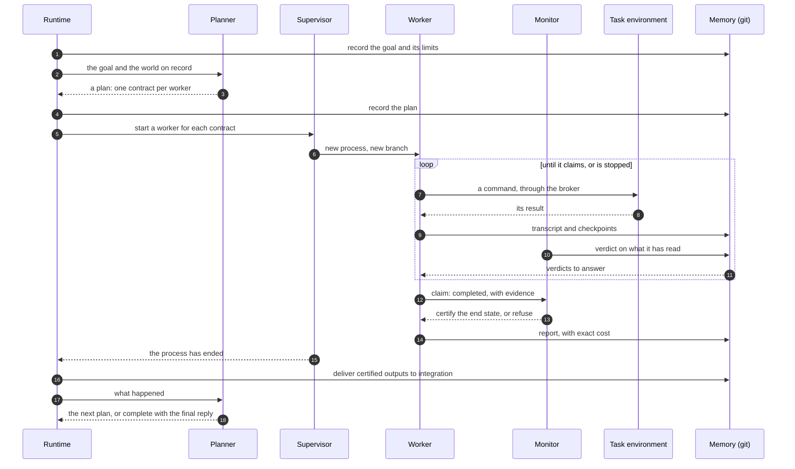

# Architecture

Taste runs a goal the way an operating system runs a job: something schedules
the work, separate processes do it, something independent checks it, and
everything they touch is kept in storage that can be inspected and rewound.
This document walks through those parts and the rules that hold them together.

<picture>
  <source media="(prefers-color-scheme: dark)" srcset="img/architecture-dark.svg">
  
</picture>

## The parts

### Central brain

One process that owns the goal from start to finish. It has three components,
composed by `taste/brains/central_host.py`.

**Planner** (`central_planner.py`). One model call per plan. It is given the
goal, the criteria that must hold at the end, and *the world*: a snapshot of
every branch and the recorded outcome of every worker so far. It returns a plan
revision:

- one **assignment** per worker, each carrying a **contract** (the task, the
  outputs to produce, and the success criteria its monitor will judge);
- its assessment of every goal criterion, with the evidence for each;
- whether the goal is complete and, for goals that owe someone an answer, the
  final reply.

The planner never sees a worker's private context. It reads what is on record.
A proposal that fails to parse changes nothing, and the reason is shown to the
planner on its next attempt.

**Runtime** (`central_runtime.py`). The loop that makes plans happen. One cycle
polls the workers, collects the reports of those that ended, delivers certified
outputs, accounts for spending, and asks the planner to revise when something
gives it a reason to: a finished worker, a failure, a refusal. While workers
are simply working it waits, watching their processes without recording
anything. A run ends when the plan is complete, or at a bound: the wall clock,
the budget, a limit on plan generations or on planner failures.

**Supervisor** (`supervisor.py`). Owns worker processes. It prepares a branch
for each assignment, starts the worker in its own process group, notices
readiness, enforces the deadline, and reaps the whole process tree at the end.
A worker is asked to stop before it is killed, so that it can settle a model
call it has paid for and write its report.

### Workers

A worker is an operating-system process with one contract, one branch of
memory and a set of tools. It loops: model call, tool call, result. It ends by
stating a structured claim: completed, blocked, or needing another turn, with
its evidence. Its report records exactly what it spent.

There are two worker harnesses behind the same supervisor:

| Harness | Model API | Where the worker acts | Module |
| --- | --- | --- | --- |
| Claude Agent SDK | Anthropic | its own git worktree, inside the SDK's sandbox | `worker_runtime.py` |
| Responses | Azure OpenAI | a shared task container, through the terminal broker | `azure_worker_runtime.py` |

### Monitors

Every worker has a monitor that only observes. It reads the worker's transcript
as it grows and records verdicts on the worker's state. The worker is shown
those verdicts and cannot claim completion until it has answered them. When the
worker does claim completion, the monitor judges the exact end state against
the contract and either certifies it or refuses. Only certified work can be
delivered. The monitor has no tools, so it cannot fix what it finds: it can
only say so. (`monitor.py`, `monitor_judge.py`)

### Memory

A session's memory is one git repository (`taste/memstore/`).

| Memory concept | In git |
| --- | --- |
| an actor's context | a branch with its own working tree, held under a lease |
| a checkpoint | a commit: files, the transcript so far, and the reason |
| a verdict | a note attached to the exact state it judges |
| a message | an entry in the recipient branch's inbox, typed and acknowledged |
| a rollback | a new commit that restores an earlier state; the failed one stays readable |
| handing work over | a typed merge, whose conflicts are values to act on |

Three branches matter to the central brain. `control` holds its own record:
plans, decisions and model receipts. `integration` holds certified results and
nothing else; a worker starts from it and delivers back into it
(`delivery.py`). Each worker has its own branch.

### Task environment and the terminal broker

When workers act on a container they share, every command goes through a
broker (`terminal_broker.py`, `terminal_service.py`, `docker_terminal.py`):

- one command runs at a time, whichever worker sent it;
- every command, its exit status and its output are written to a ledger before
  the worker sees the result;
- a command that runs past its timeout is killed with the processes it
  started, and what it had printed is kept. The container stays usable;
- a command whose outcome cannot be confirmed is recorded as uncertain and is
  never run again on a guess.

### Model calls

Every model call goes through one facade (`taste/llm.py`, `taste/providers/`,
`taste/pricing.py`):

- a model with no verified price cannot be called;
- before a call is sent, its worst-case cost is reserved against what is left
  of the budget, so a goal cannot overspend by accident;
- the reply is journaled before anything acts on it. After a crash the stored
  reply is replayed; the provider is not asked, and not paid, a second time;
- a reply that was lost in transit has an unknown cost. It is charged at the
  most it could have cost, and that stays visible in the accounts.

## The life of a goal

## Rules that hold everywhere

**Intent, effect, receipt.** Anything that cannot be undone (a model call, a
process start, a command, a delivery) is recorded as an intent before it
happens and as a result after. A crash between the two leaves an intent with no
result. On restart that effect is looked up, not repeated: a paid reply is
replayed from its journal, a started process is found by its identity, a
command with no confirmed outcome is marked uncertain.

**Nothing unverified moves forward.** A worker's claim is not evidence. Work
reaches `integration` only after a monitor has certified the exact state it
came from.

**Nothing is deleted.** A rollback appends. A failed attempt keeps its files,
its transcript and the reason it failed, which is what the next plan is
written from.

**A goal ends with an answer.** A goal that owes a reply reserves part of its
time for it. If the clock, the budget or the planner fails first, the workers
are stopped in good order, their reports are collected, and the planner is
asked once more for a closing reply that says what was done and what was not.

**Limits are part of the goal.** The budget, the deadline, the models and the
call limits are fixed when the goal is admitted. A plan cannot raise them.

## Benchmarks

`taste/benchmarks/` adapts the runtime to a benchmark harness. For the Harbor
framework the adapter is `harbor_agent.py`: it runs one task as a goal in the
benchmark's own container,
writes one trajectory in the order things happened, and hands the container to
the benchmark's verifier whatever its own audit found. Gaps are recorded as
flags, never used to withhold a task from grading. See
[azure-harness.md](azure-harness.md) and
[`infra/azure/benchmarks.md`](../infra/azure/benchmarks.md).

## Where it came from

The repository began as a single-process kernel (`taste/kernel.py`,
`cores.py`, `recovery.py`, `memory.py`): a planner, a worker and a monitor as
functions in one loop, committing after every step and rolling back on a
failed check. That line still backs the `taste` command and the demos in
`examples/`. The multi-process runtime described here grew out of it; the
memory layer was rewritten first (`taste/memstore/`), then the brain layer on
top of it (`taste/brains/`).

## Module map

| Path | What it holds |
| --- | --- |
| `taste/memstore/` | the memory layer: `Store`, `Branch`, checkpoints, verdicts, inboxes, typed merges |
| `taste/brains/central_planner.py` | goals, criteria, plan revisions, the planner prompt and its strict parser |
| `taste/brains/central_runtime.py` | the cycle, decisions, budgets, stops and the closing reply |
| `taste/brains/supervisor.py` | preparing, starting, stopping and reaping worker processes |
| `taste/brains/monitor.py`, `monitor_judge.py` | watching, verdicts and terminal certification |
| `taste/brains/delivery.py` | projecting a certified worker state into `integration` |
| `taste/brains/worker_runtime.py` | the Claude Agent SDK worker |
| `taste/brains/azure_worker_runtime.py`, `responses_*.py` | the Azure OpenAI worker and its call journal |
| `taste/brains/terminal_*.py`, `docker_terminal.py` | the terminal broker, its RPC service and the Docker transport |
| `taste/benchmarks/` | benchmark adapters and trajectory export |
| `taste/llm.py`, `taste/providers/`, `taste/pricing.py` | the model facade, providers and the price table |
| `taste/kernel.py`, `cores.py`, `recovery.py`, `memory.py` | the original single-process kernel |
